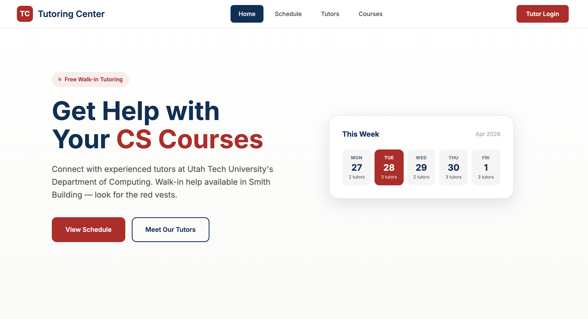

# UTU Tutoring Center

A web app for Utah Tech University's Department of Computing tutoring center. Students can see who's tutoring and when, and tutors can manage their own schedules through a dashboard.

**Live site:** https://utututoring.vercel.app

---

## Screenshot



## What it does

- Public schedule showing all tutors and their weekly hours
- Tutor profiles with courses they cover
- Admin dashboard to manage tutors, courses, and invite codes
- Tutor dashboard to manage their own schedule and mark absences
- TV display view designed to be shown on a screen in Smith Building
- Invite code system — admins generate codes, tutors use them to register

---

## Tech stack

- **Frontend:** Vue 3, hosted on Vercel
- **Backend:** Node.js + Express, hosted on Railway
- **Database:** MongoDB Atlas
- **Image storage:** Cloudinary (tutor profile photos)

---

## Running locally

### With Docker (easiest)

Make sure Docker Desktop is installed, then:

```bash
docker compose up
```

Visit http://localhost. On first run, seed the database:

```bash
docker compose exec backend node seed.js
```

### Without Docker

You need Node.js and MongoDB installed.

**Backend:**

```bash
cd backend
npm install
npm run seed
npm run dev
```

Create a `.env` file in the `backend/` folder first — see the Environment Variables section below.

**Frontend:**

```bash
cd frontend
npm install
npm run dev
```

---

## Environment variables

Create a `.env` file in the `backend/` folder:

```
MONGODB_URI=mongodb://localhost:27017/tutoring
JWT_SECRET=your-secret-here
JWT_EXPIRES_IN=7d
CLOUDINARY_CLOUD_NAME=your-cloud-name
CLOUDINARY_API_KEY=your-api-key
CLOUDINARY_API_SECRET=your-api-secret
```

---

## Default login credentials

After running the seed:

| Email                | Password    | Role         |
| -------------------- | ----------- | ------------ |
| jarod@utahtech.edu   | tutoring123 | Admin        |
| austin@utahtech.edu  | tutoring123 | Senior Tutor |
| drew@utahtech.edu    | tutoring123 | Tutor        |
| theisen@utahtech.edu | tutoring123 | Tutor        |

---

## Running tests

```bash
cd backend
npm test
```

Tests use a local MongoDB instance (`tutoring-test` database).

---

## Resetting passwords

If logins stop working on production:

```bash
cd backend
railway run node reset-passwords.js
```

---

## Project structure

```
seniorproject/
├── backend/
│   ├── models/        # mongoose schemas
│   ├── routes/        # api endpoints
│   ├── middleware/    # auth + admin checks
│   ├── utils/         # helpers (invite code gen, slug gen)
│   ├── tests/         # jest test files
│   ├── seed.js        # populates the database
│   └── server.js      # entry point
├── frontend/
│   ├── src/
│   │   ├── views/     # page components
│   │   ├── components/# reusable components
│   │   ├── services/  # api calls
│   │   └── router/    # vue router config
├── docs/              # diagrams
└── docker-compose.yml
```
